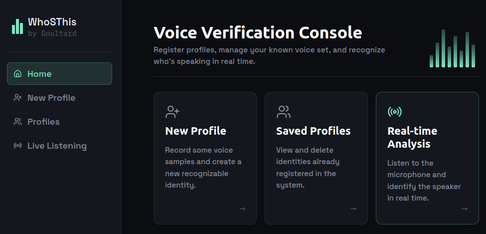
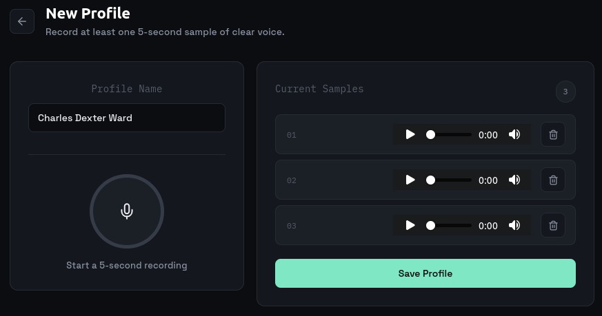
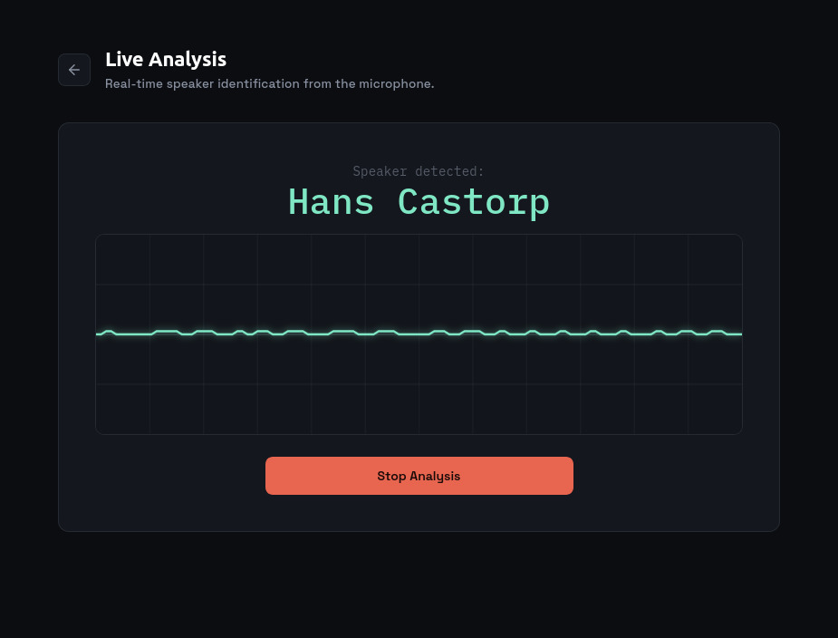

# 📞 WhoSThis — Real-Time Speaker Identification System
This project is a lightweight and real-time speaker identification system that is able to recognize voices from short audio samples using a compact deep learning model. Built with a FastAPI backend and a React frontend, it lets users create speaker profiles, compare live audio against stored identities, and perform real-time voice matching with low-latency inference.

## 🚀 Key Features
- **Real-time speaker identification** from live audio streams using a trained deep-learning voice embedding model.
- **Speaker profile creation and management**, allowing users to register voices and compare live recordings against saved identities.
- **Fast API-based backend** for audio processing, embedding extraction, profile storage, and WebSocket-based live recognition.
- **React frontend** for a simple, interactive user experience with profile creation, listing, and deletion.
- **Lightweight, efficient model design** that balances accuracy and inference speed for practical deployments.
- **Flexible architecture** that supports future extensions such as additional models, improved threshold tuning, or multi-user enrollment workflows.

## 📸 Working




## 📦 Installation
To set up the project, follow these steps:
1. **Prerequisites**: Make sure you have Python 3.10+ and Node.js 18+ installed.
2. **Clone the Repository**: Run `git clone https://github.com/DavidePietragalla/WhoSThis` to download the project.
3. **Install the Python Dependencies**: Run `pip install fastapi uvicorn torch torchaudio speechbrain`.
4. **Install the Frontend Dependencies**: Move to the frontend folder and run `npm install`.
6. **Start the Application**: You should be able to run both backend and frontend with `npm run dev:all`

## 📂 Project Structure
```markdown
WhoSThis/
├── frontend/
│   ├── public/
│   │   ├── favicon.svg
│   │   └── icons.svg
│   ├── src/
│   │   ├── assets/
│   │   │   ├── hero.png
│   │   │   ├── react.svg
│   │   │   └── vite.svg
│   │   ├── App.css
│   │   ├── App.jsx
│   │   ├── index.css
│   │   └── main.jsx
│   ├── .gitignore
│   ├── eslint.config.js
│   ├── index.html
│   ├── package.json
│   ├── package-lock.json
│   └── vite.config.js
├── main.py
├── student_model.py
├── notebook.ipynb
├── README.md
└── voice_profiles.json
```
